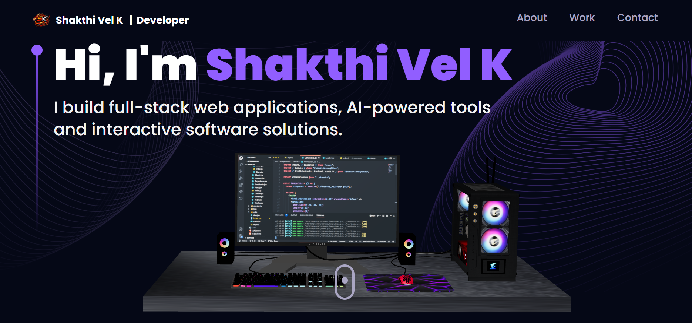
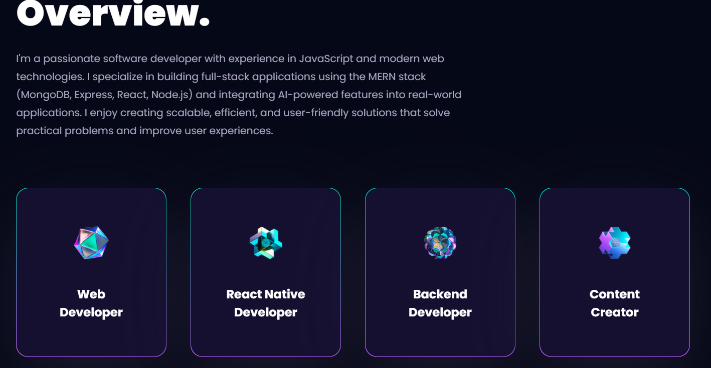
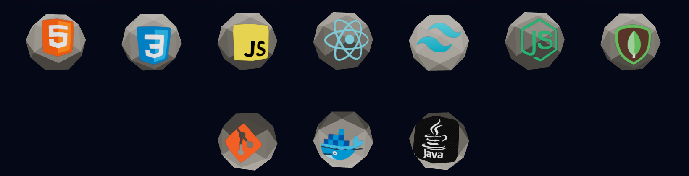
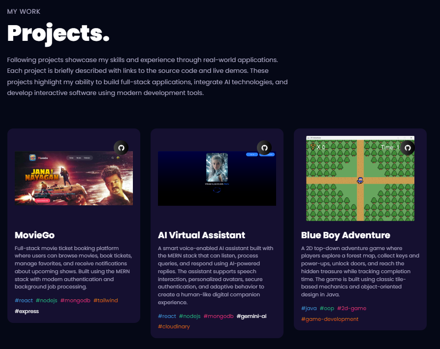
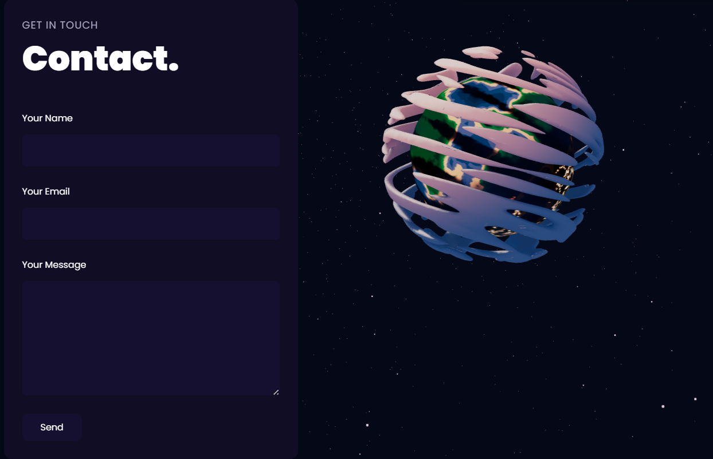

# 🚀 3D Developer Portfolio
A modern, interactive 3D portfolio website showcasing my skills, projects, and experience as a full-stack developer. Designed to deliver an immersive and engaging user experience through smooth animations and visually rich elements.

#### 🌐 Live Demo
👉 https://3-d-portfolio-nv17.vercel.app/

## 📌 About The Project

This portfolio represents my journey as a developer, highlighting:

- Real-world project experience
- Problem-solving skills
- Ability to build scalable applications
- Focus on clean UI and user experience  
The goal of this portfolio is to present my work in a way that is both professional and visually engaging.

## ✨ Features
- 🎯 Interactive landing section
- ⚡ Smooth animations and transitions
- 📱 Responsive design across devices
- 🧩 Clean and structured layout
- 🎮 Project showcase with live previews
- 🌙 Modern dark-themed interface

## 📂 Sections Overview

#### 🏠 Home

Introduction and personal branding
#### 👨‍💻 Overview

- Brief about my experience and interests
- Focus on building impactful applications
### 🧠 Skills

- Highlights of development capabilities
- Covers web, backend, and application development
### 🚀 Projects

- MovieGo – Movie ticket booking platform
- AI Virtual Assistant – Smart assistant with voice interaction
- Blue Boy Adventure – 2D adventure game
- Each project includes a short description and demonstration.

### 📞 Contact

Easy way to connect and collaborate

### 👨‍💻 Author
**Shakthi Vel K**  
Full Stack Developer

### ⭐ Support

If you like this project:

⭐ Star the repository  
🔁 Share it  
💬 Give feedback
